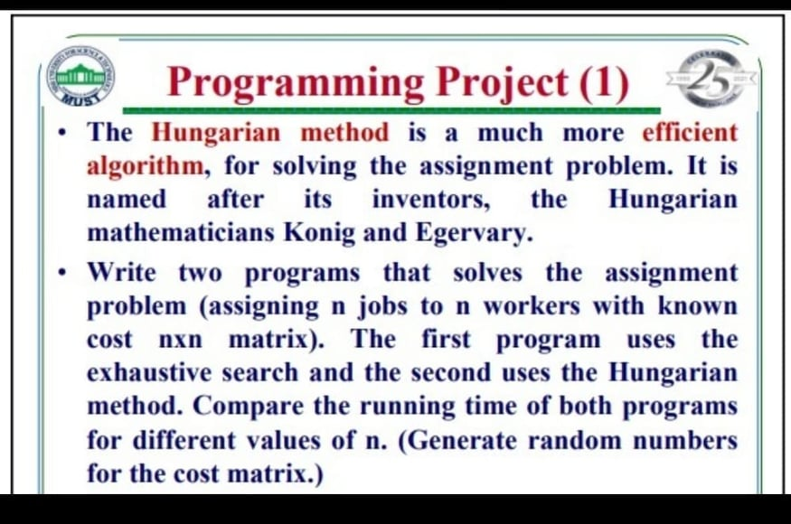

***
### Brute force and hungarian algorithms for solving the assignment problem.

This repo is my submission to a university assignment (MUST University - *Design and Analysis of Algorithms*)

#### How to Run
Just clone this repo and use the Makefile attached. (Run `$ make`.)

#### My Progress
- [x] Brute Force
- [x] Hungarian Algorithm

#### All credits for the hungarian method's implementation go to to [`mcximing`](https://github.com/mcximing/hungarian-algorithm-cpp).

#### Results
|n|Hungarian|Brute Force|
| :-------------: |:-------------:| :-----:|
|5|0 ms|1 ms|
|6|0 ms|3 ms|
|7|0 ms|20 ms|
|8|0 ms|114 ms|
|9|0 ms|532 ms|
|10|0 ms|5256 ms|
|11|0 ms|60920 ms|
|20|0 ms|-|
|50|1 ms|-|
|100|3 ms|-|
|1000|350 ms|-|
|2000|1684 ms|-|
|4000|6942 ms|-|
|8000|25684 ms|-|
|10000|57611 ms|-|
|20000|-|-|

All calculations were carried out on the same machine with the same cost matrix, each value of n was run 10 times and the average is included in the above table.